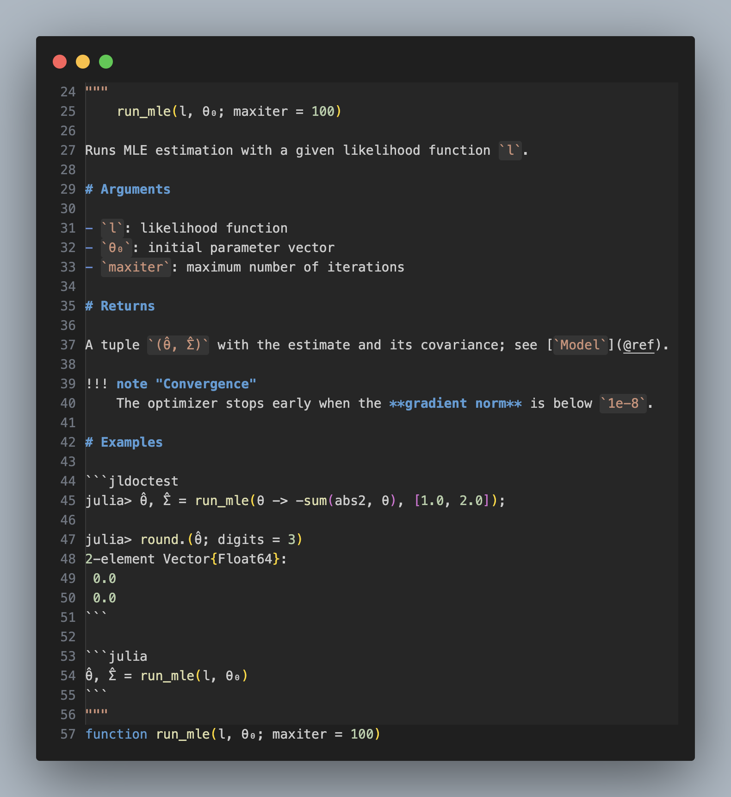
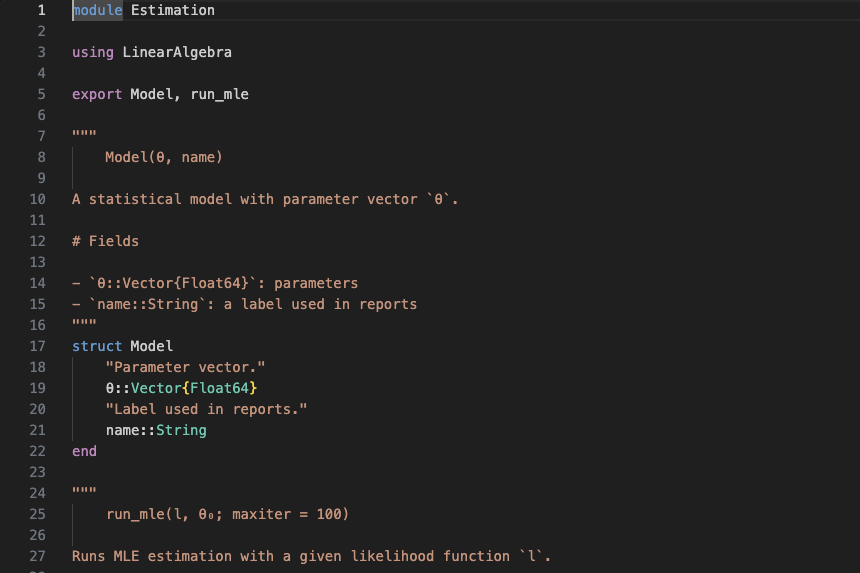
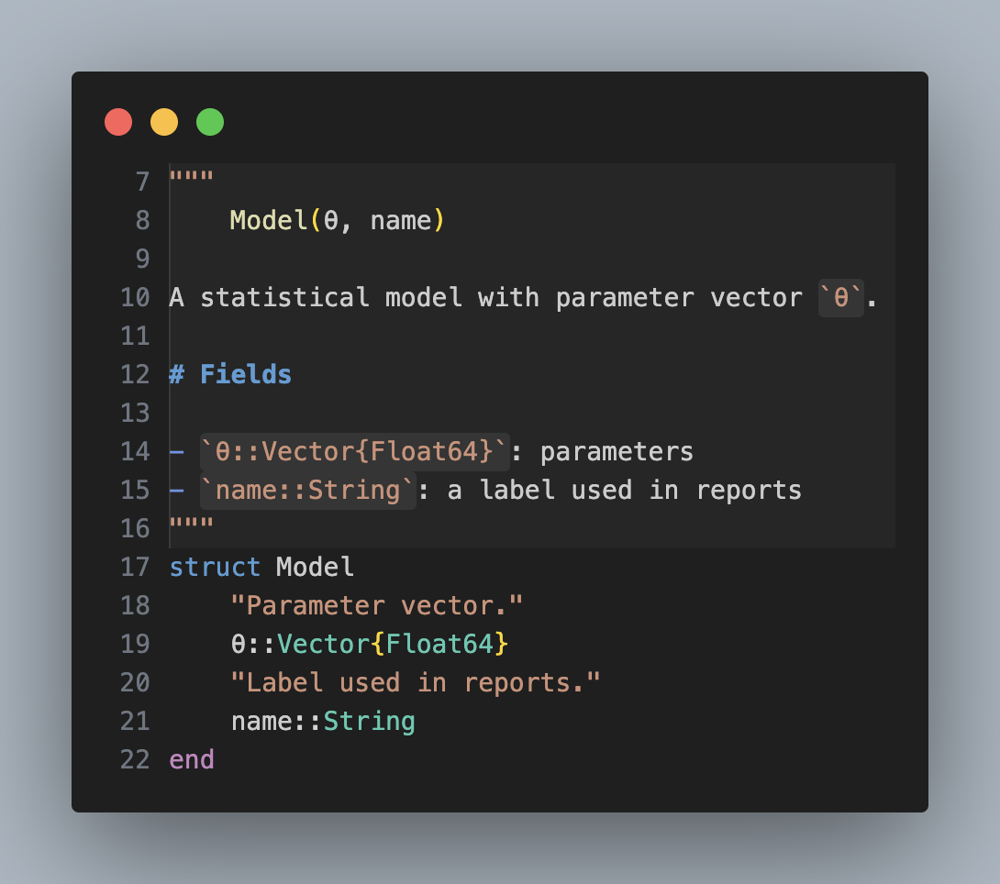
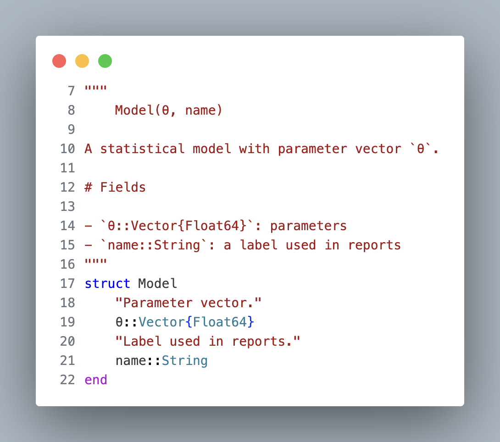
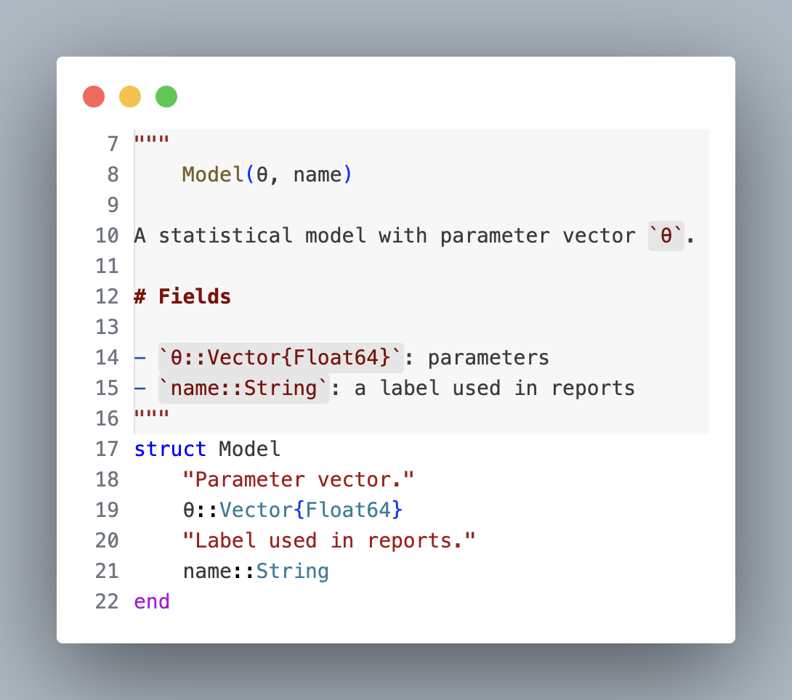

# Julia Docstring Highlighter

Subtle, theme-native highlighting for Julia docstrings in VS Code: a light documentation region, plus Markdown structure and real Julia syntax inside it. Every color comes from your current theme.

<p align="center">
  
</p>

| Before | After |
| --- | --- |
|  |  |
|  |  |

## What it does

- **Documentation region.** Every docstring gets a very light whole-line background (about 3% opacity) and a 1px guide on the left edge, so you can see at a glance where documentation starts and ends. It never looks like a card and never outshines your code.
- **Markdown, in your theme's Markdown colors.** Prose, headings (`# Arguments`), lists, bold, italic, links and inline code look exactly as your theme shows them in a Markdown file, and Documenter admonitions (`!!! note`) like headings. Inline code also gets a faint background chip, so that it stands out in themes that give it no color of its own.
- **Real Julia inside, in your theme's Julia colors.** The indented signature at the top of a docstring and fenced examples (unlabelled, `julia`, `jldoctest`, `julia-repl`, `@example`, `@repl`, `@setup`) are highlighted exactly like the Julia code around the docstring. In `jldoctest` blocks the `julia>` prompt is marked separately. Other languages (`math`, `text`, …) stay plain.
- **Regions only for real docstrings.** The background, guide and inline code chips follow the rules of Julia's own parser: `x = """…"""`, `println("""…""")`, strings separated from the next expression by a blank line or a comment line, bare `raw"…"` / `md"…"` strings and the like are left alone. The Markdown and Julia highlighting inside applies to `@doc` docstrings and to docstrings whose opening `"""` is at the start of a line; without the parser, a grammar cannot tell a one-line `"…"` docstring or an indented `"""` from an ordinary string, so these keep the string color.

### What counts as a docstring

The same strings Julia attaches as documentation:

- a string literal (`"…"` or `"""…"""`) that is a statement of its own and is followed, on the same line or after exactly one line break, by the documented expression — at the top level, in `module` / `baremodule`, `begin` and `quote` blocks;
- `@doc str target`, `@doc str` + line break + `target`, `@doc raw"""…"""`, `@doc str ->` + line break + `target`, `Base.@doc` / `Core.@doc`, and `@doc(str, target)`.

Strings inside function bodies and `if` / `for` / `while` / `let` / `try` / `do` blocks are not decorated, since Julia does not treat them as docstrings. Neither are the strings before the fields of a `struct`: they are left as plain strings, while the struct's own docstring gets its region.

## Requirements

- VS Code 1.108 or later.
- Julia syntax highlighting: VS Code's built-in Julia grammar is enough. The official [Julia extension](https://marketplace.visualstudio.com/items?itemName=julialang.language-julia) (stable or insider) works too and is recommended for everything else Julia; it is not required and is not installed automatically.

## Settings

| Setting | Default | |
| --- | --- | --- |
| `juliaDocstringHighlight.enabled` | `true` | Turns all decorations on or off. |
| `juliaDocstringHighlight.showBackground` | `true` | The whole-line region background. |
| `juliaDocstringHighlight.showGuide` | `true` | The 1px guide on the left edge. |
| `juliaDocstringHighlight.showInlineCodeBackground` | `true` | The chip behind inline code. |

The Markdown and Julia highlighting inside docstrings comes from a TextMate grammar, which VS Code loads statically; it cannot be switched off by a setting. To turn it off, disable the extension.

## Colors

The colors of the region, the guide and the inline code chip are theme color slots, not settings, so each theme kind gets suitable defaults and switching themes needs no reload:

| Color | Dark | Light | High contrast |
| --- | --- | --- | --- |
| `juliaDocstring.background` | `#FFFFFF08` | `#00000008` | off |
| `juliaDocstring.guide` | `#FFFFFF18` | `#00000018` | the theme's `contrastBorder` |
| `juliaDocstring.inlineCodeBackground` | `#FFFFFF12` | `#00000012` | off |

Override them in your settings, globally or per theme:

```jsonc
"workbench.colorCustomizations": {
  "juliaDocstring.background": "#7F849C0D",
  "juliaDocstring.guide": "#7F849C30",
  "[GitHub Light Default]": {
    "juliaDocstring.background": "#00000006"
  }
}
```

### Text and code colors

The text of a docstring is scoped like a Markdown file and its code like Julia code, outside any string scope, so your theme colors both exactly as it colors Markdown and Julia; only the quotes keep the string color. To give the prose of docstrings a color of its own, for example your theme's string color:

```jsonc
"editor.tokenColorCustomizations": {
  "textMateRules": [
    { "scope": "embed.docstring.julia meta.paragraph.markdown", "settings": { "foreground": "#CE9178" } }
  ]
}
```

## How it works

Three independent layers:

1. **Detection:** a small, dependency-free lexical scanner finds docstrings with the rules of Julia's parser (JuliaSyntax): statement position, exactly one line break before the documented expression, block-closing keywords, `@doc` forms. It rescans a document 100 ms after you stop typing; a 50,000-line file takes about 8 ms on an Apple Silicon laptop.
2. **Decoration:** three decoration types (background, guide, inline code chip) whose colors are `ThemeColor` references to the slots above.
3. **Inner highlighting:** a TextMate grammar injected into the Julia grammar. It takes over the Julia grammar's docstring rules and scopes the text like a Markdown file and the examples like Julia code, so every theme colors them as it colors Markdown and Julia; the quotes keep their string scope. It is guarded so that an unclosed code fence or quote in an example can never leak into the code after the docstring.

## Development

```bash
npm install
npm run compile      # type-check and bundle to dist/extension.js
npm test             # unit + grammar + integration tests
npm run test:oracle  # cross-check the fixtures against the Julia parser (needs `julia`)
npm run perf         # detector performance budget
npm run package      # build the .vsix into vsix/
npm run release-check  # all of the above, on the oldest supported and the stable VS Code, with the oracle required
```

Press <kbd>F5</kbd> in VS Code to start an Extension Development Host with `test/fixtures/showcase.jl`.

## License

[MIT](LICENSE)
